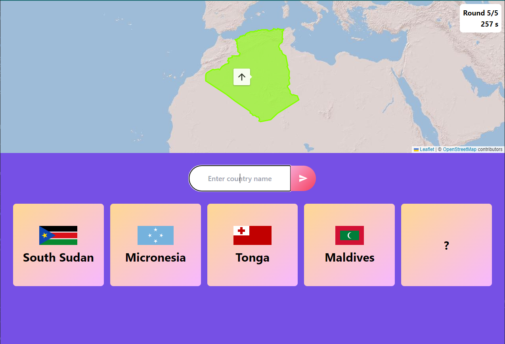
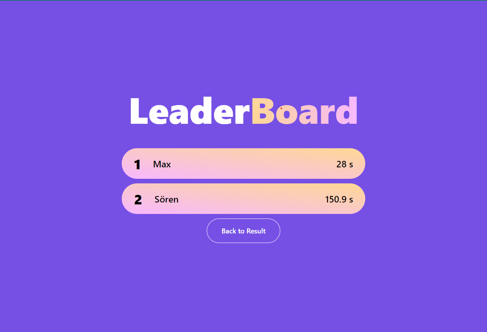

# [GeoHero](https://geohero.soerenchrist.de)

## What?
GeoHero is a geography based quiz. Try to guess the searched countries as fast as possible. Start by guessing any country. The game will present you your guess on a map. Depending on how far your guess is away, the color of the country will be more red or green. If configured you will get more information like distance or direction of the searched country, which will make it a bit easier.

The game supports challenging friends. It will generate a random series of countries, which will stay the same for your friends. Authentication is not required.

## How?
To build this project, I used a variety of different technologies:
- [NextJS](https://nextjs.org/): Base framework
- [DynamoDB](https://aws.amazon.com/de/dynamodb/): The undelying database, using single-table design 
- [S3](https://aws.amazon.com/de/s3/): File repository to save the countries flags and shape files
- [tRPC](https://trpc.io/): End-to-end typesafe API calls
- [Tailwind](https://tailwindcss.com/): The styling framework
- [Leaflet](https://leafletjs.com/): The awesome library that makes displaying maps easy
- [Vercel](https://vercel.com): For building and hosting

## Screenshots
 \
Main game screen

 \
Leaderboard of challenged friends

## Contribute / Run it yourself

To run this project by yourself, there is a bit of setup required. 
First you will have to setup a DynamoDB table and a S3 bucket. I recommend to create a IAM user who has just the permissions to access the Table and the Bucket. \
Make sure to note the users access id and access secret. Create a `.env` file located in your project root and add the following environment variables with your values:

```
GEOHERO_ACCESS_ID=your-access-id
GEOHERO_ACCESS_SECRET=your-access-secret
AWS_GEOHERO_REGION=your-aws-region
DYNAMO_TABLE_NAME=your-dynamodb-table-name
S3_BUCKET_NAME=your-s3-bucket-name
```

The project includes the country data, the shape files for the countries, as well as the flags. To upload them to the DynamoDB table and S3 bucket use the files inside the `scripts` folder.
You have to provide your credentials to the scripts.
